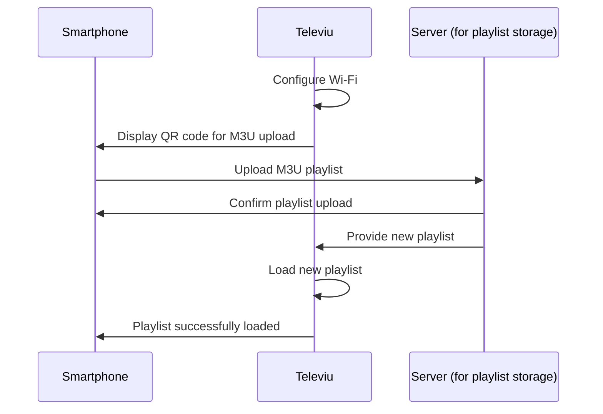

> [!WARNING]  
> This project is currently under construction. Changes and updates will be applied in the future.

  

Televiu is a simple and intuitive TV player for M3U playlists, designed for kiosk environments.

  

## Features

- Seamless playback of M3U playlists
- Minimalist and user-friendly interface
- Designed for dedicated TV playback
- Supports devices like Raspberry Pi and OrangePi
- Remote upload and management of M3U playlists
- Control using infrared sensor

## How it works

## About

Televiu is an open-source project aimed at providing a straightforward media player experience without unnecessary complexity.

## License

This project is licensed under the [MIT License](LICENSE).
